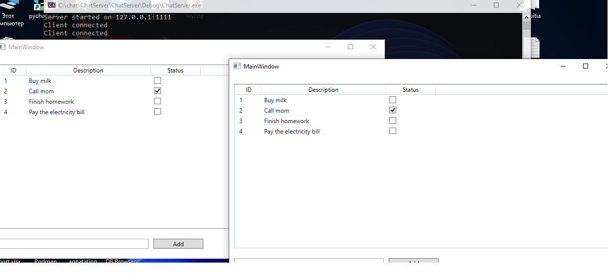

# Client-Server To-Do List Application

This is a simple client-server application that allows multiple users to manage a shared to-do list. The server is written in C++, and the client is written in C# using WPF.

## System Requirements

### For Server (C++)

* Windows Operating System (Winsock API).
* C++ compiler with C++11 support or later (for `std::thread`, `std::mutex`). Visual Studio 2019 or later is recommended.

### For the client (C# WPF)

* Windows operating system.
* .NET Framework 4.7.2 or later (or .NET 5+/Core). Visual Studio 2019 or later is recommended.

## How to build and run
### Project structure
```
chat/
├── ChatClient/ # Client on C# (WPF)
├── ChatServer/ # Server on C++
├── .gitignore
└── README.md
```
### Server (C++)

1. **Open the project:** Open the `ChatServer.sln` file (or similar if you create a new project) in Visual Studio.
2. **Dependencies:**
* Winsock2: This library is part of the Windows SDK and is usually available out of the box when you install Visual Studio with the C++ development components. No additional installation is required.
* The project directly includes `ws2_32.lib` via `#pragma comment(lib, "ws2_32.lib")`, so explicitly adding it to the project properties is not required, but may be required if porting to another project.
3. **Build:** Select the `Debug` or `Release` configuration and build the project (`Build > Build Solution`).
4. **Run:** Run the compiled executable (e.g. `Debug/ChatServer.exe`). The server will listen on `127.0.0.1:1111`.
###  Building via terminal (CMake)

```bash
cd ChatServer
mkdir build
cd build
cmake ..
cmake --build .
```
### Client (C# WPF)

1. **Open the project:** Open the `ChatClient.sln` (or similar) file in Visual Studio.
2. **Dependencies:** Standard .NET Framework libraries included in the project. No additional dependencies are required.
3. **Build:** Select the `Debug` or `Release` configuration and build the project (`Build > Build Solution`).
4. **Run:** Run the compiled executable (e.g. `Debug/ChatClient.exe`). The client will automatically try to connect to `127.0.0.1:1111`.

**Important:** Start the server first, then one or more client instances.

## Design and Solution Choices

### Communication Protocol

A simple text protocol over TCP/IP socket connections was chosen for communication between the client and the server.

* **TCP/IP:** Provides reliable, ordered delivery of data, which is critical to maintaining todo list consistency.
* **Text Protocol:**
* **"ADD [description]":** The client sends this command to add a new task. The server generates an ID and returns the updated list to all clients.
* **"TOGGLE [ID]":** The client sends this command to change the status of the task with the specified ID. The server updates the status and returns the updated list to all clients.
* **"GET":** The client sends this command to get the full list of tasks (e.g. when connecting).
* **Real-time synchronization:** Every time the list changes (adds or changes the status), the server broadcasts the *full current list* to all connected clients. Clients parse this list and update their UI. This ensures that all users immediately reflect the changes.

### Server data management

* The to-do list (`std::vector<TodoItem>`) is stored in the server's RAM.
* `std::recursive_mutex` is used to protect the to-do list and the list of connected clients from being accessed simultaneously by different threads, ensuring thread safety.
* Each `TodoItem` has a unique `id` (generated by the server), `description` (a string), and `completed` (a boolean value).

### C# WPF Client

* **UI:** Uses standard WPF elements: `ListView` to display the list, `TextBox` to enter the description of the new task, and `Button` to add it.
* **UI Reactivity:** `ObservableCollection<TodoItem>` is used to bind data to the `ListView`, allowing the UI to be automatically updated when the collection changes.
* **Receiving Updates:** A separate background thread (`listenThread`) constantly listens for incoming messages from the server. When a new list of data is received, it parses it and updates the `ObservableCollection` via `Application.Current.Dispatcher.Invoke` so that the changes occur on the UI thread.
* **Interaction with the server:** When adding a task or changing the status, the client sends the corresponding text command to the server.

### Problems and solutions

* **Thread safety:** The main challenge was to ensure thread-safe access to shared data (todo list, client list) on the server. This was solved with `std::recursive_mutex`.
* **UI update from background thread (WPF):** WPF requires that changes to UI elements are made on the main UI thread. This was solved with `Dispatcher.Invoke`.
* **State synchronization:** The strategy of sending the full list on each change was chosen, which simplifies the client logic for updating the state.
## Possible Improvements

* **Optimized Communication Protocol:** Instead of sending the entire list on every change, send only deltas (add a single item, change the status of a single item). This would significantly reduce network traffic and parsing load for large task lists.
* **Robust Message Handling:** Implement a protocol using a fixed message length header or clear message terminators to prevent parsing errors due to partial data reception.
* **Server Client Disconnection Handling:** More robust logic for detecting and removing "dead" client sockets on the server side.
* **Server Error Handling:** Add error responses to the client (e.g., "ADD_FAILED", "ITEM_NOT_FOUND").
* **Input Validation:** Add additional input validation on the server side to improve robustness against malformed requests.
* **Data Persistence:** Implement a mechanism to save the to-do list to a file (e.g., CSV, JSON) when the server shuts down and load it on startup, so data is not lost.

## License

This project is licensed under the MIT License